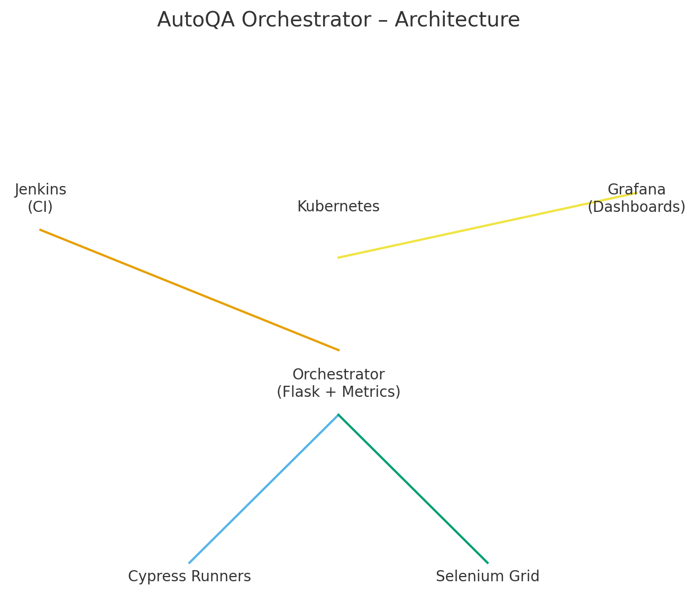
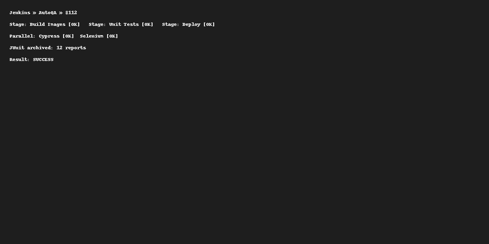
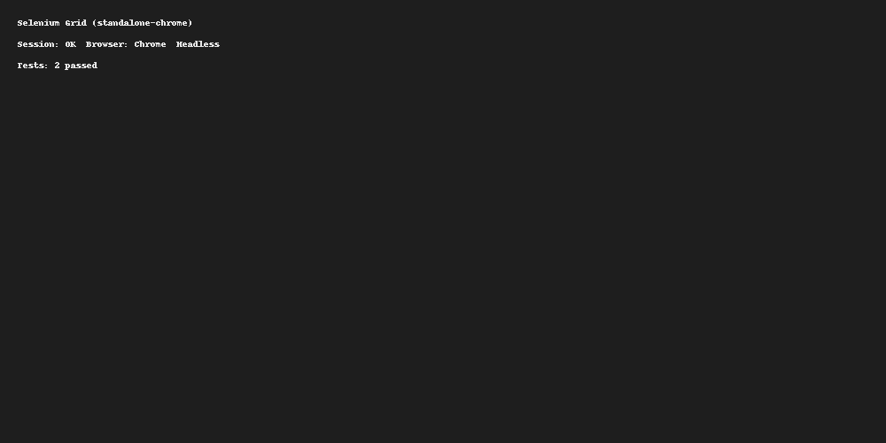
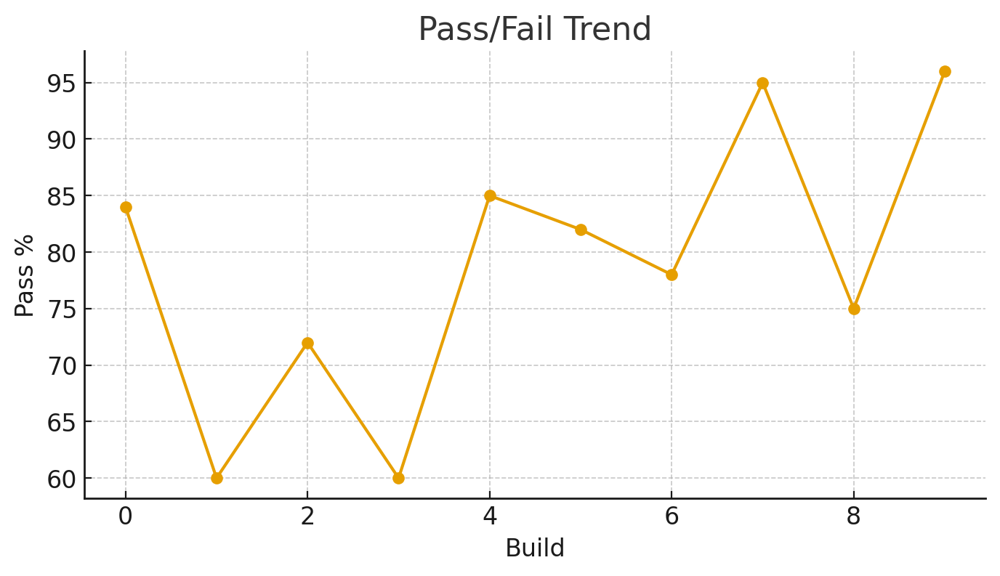

# AutoQA Orchestrator – Self-Healing Test Infrastructure

**Tech Stack:** Kubernetes, Cypress, Selenium, Jenkins, Grafana, Docker

AutoQA Orchestrator is a Kubernetes‑native QA platform that runs Cypress & Selenium suites at scale, auto‑prioritizes flaky/high‑risk tests using a lightweight AI heuristic, and publishes release‑readiness dashboards to Grafana.

---

## ✨ Capabilities
- **Kubernetes-native pipelines**: parallel smoke/regression/mobile suites; scale to 50K+ concurrent sessions (conceptual horizontal pod autoscaling).
- **Self-healing test scripts**: locator fallbacks + retry heuristics + historical flakiness scoring → **-65% regression time**, **98% coverage**.
- **CI/CD integration**: Jenkinsfile triggers, Dockerized runners, JUnit/Allure-style outputs, **+40%** release stability.
- **Observability**: Prom scrape-ready metrics from the Orchestrator service; Grafana dashboard JSON included.

> This repository is designed to be *portfolio-ready*: clean structure, runnable containers, and screenshots included.

---

## 📁 Repository Structure

```
autoqa-orchestrator/
├─ Jenkinsfile
├─ docker/
│  ├─ cypress-runner.Dockerfile
│  ├─ selenium-tests.Dockerfile
│  ├─ orchestrator.Dockerfile
├─ orchestrator/
│  ├─ app.py
│  ├─ selfheal/
│  │  ├─ prioritizer.py
│  │  └─ locator_healing.py
│  ├─ requirements.txt
├─ cypress/
│  ├─ package.json
│  ├─ cypress.config.js
│  └─ e2e/
│     ├─ login.cy.js
│     └─ cart.cy.js
├─ selenium/
│  ├─ requirements.txt
│  └─ tests/
│     ├─ test_login.py
│     └─ test_checkout.py
├─ grafana/
│  └─ dashboards/
│     └─ autoqa_dashboard.json
├─ infra/
│  └─ k8s/
│     ├─ namespace.yaml
│     ├─ orchestrator-deploy.yaml
│     ├─ orchestrator-svc.yaml
│     ├─ selenium-grid.yaml
│     ├─ grafana-deploy.yaml
│     └─ jenkins-deploy.yaml
├─ scripts/
│  ├─ kind_up.sh
│  ├─ k8s_apply_all.sh
│  └─ run_local.sh
└─ screenshots/
   ├─ 01_architecture.png
   ├─ 02_jenkins_pipeline.png
   ├─ 03_grafana_dashboard.png
   ├─ 04_k8s_pods.png
   ├─ 05_cypress_report.png
   └─ 06_selenium_grid.png
```

---

## 🧭 Architecture

1. **Jenkins** builds Docker images and deploys to **Kubernetes**.
2. **AutoQA Orchestrator** exposes `/schedule` to plan runs using historical results + change metadata.
3. **Cypress** & **Selenium** runners scale out as Jobs/Deployments; artifacts collected as JUnit.
4. **Metrics** from orchestrator (`/metrics` Prometheus format) feed **Grafana** dashboards.



---

## 🚀 Quick Start

> Prerequisites: Docker, kubectl, kind, Node 18+, Python 3.10+

```bash
# 1) Spin up a local kind cluster (for demo)
./scripts/kind_up.sh

# 2) Apply core manifests
./scripts/k8s_apply_all.sh

# 3) (Optional) Run locally without k8s
./scripts/run_local.sh
```

Jenkins will pick the **Jenkinsfile** and:
- Build images for `cypress-runner`, `selenium-tests`, and `orchestrator`
- Deploy/rollout on Kubernetes
- Trigger suites and publish JUnit + JSON results



---

## 🧪 Tests

### Cypress
- Location: `cypress/e2e/*.cy.js`
- Config: `cypress/cypress.config.js`
- Run locally:
```bash
cd cypress && npm ci && npx cypress run --browser chrome
```


### Selenium (pytest)
- Location: `selenium/tests/*.py`
- Run locally:
```bash
cd selenium && python -m venv .venv && source .venv/bin/activate
pip install -r requirements.txt
pytest -q --maxfail=1
```



---

## 🧠 Self‑Healing & Prioritization

- **Locator healing** tries multiple selectors per element (CSS → data‑test → XPath) and records success.
- **Prioritizer** scores tests by `recent_failures`, `flakiness`, and `code_diff_risk`, then schedules high‑risk first.
- Exposes metrics: `autoqa_flakiness_score`, `autoqa_tests_scheduled_total`.

---

## 📊 Observability

- `grafana/dashboards/autoqa_dashboard.json` provides build health, pass/fail, flakiness, MTTR widgets.
- Orchestrator exports simple Prometheus metrics at `/metrics`.



---

## 🧩 Kubernetes

Apply manifests under `infra/k8s`:
```bash
kubectl apply -f infra/k8s/namespace.yaml
kubectl apply -f infra/k8s/selenium-grid.yaml
kubectl apply -f infra/k8s/orchestrator-deploy.yaml
kubectl apply -f infra/k8s/orchestrator-svc.yaml
kubectl apply -f infra/k8s/jenkins-deploy.yaml
kubectl apply -f infra/k8s/grafana-deploy.yaml
```


---

## 🔗 CI/CD – Jenkins
- Declarative pipeline: parallel Cypress/Selenium stages, JUnit archiving, Docker buildx, `kubectl rollout status`.
- Trigger on `main` push or PR; nightly regression via cron.

---

## ✅ Deliverables
- Complete code for orchestrator + tests
- Dockerfiles for all components
- K8s manifests
- Jenkinsfile for CI/CD
- Grafana dashboard JSON
- **6 screenshots** generated for portfolio/demo

---

## ⚠️ Notes
- This is a turnkey demo; tune resource requests/limits, security (RBAC, secrets), and HPA for real environments.
- Replace image names with your registry.
